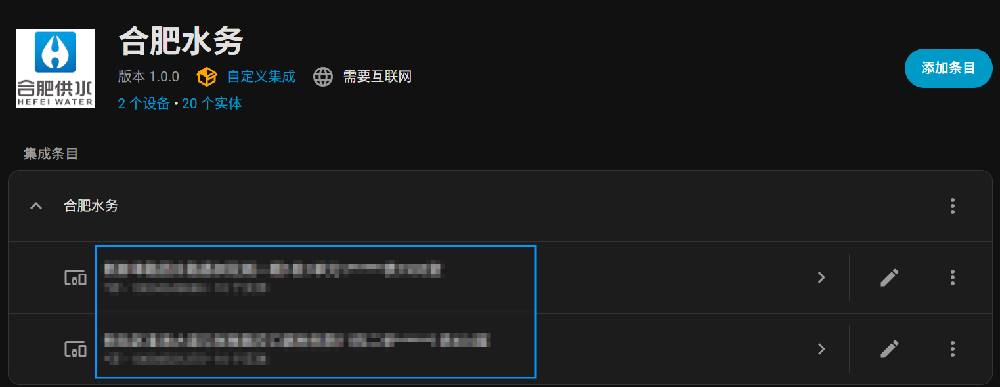
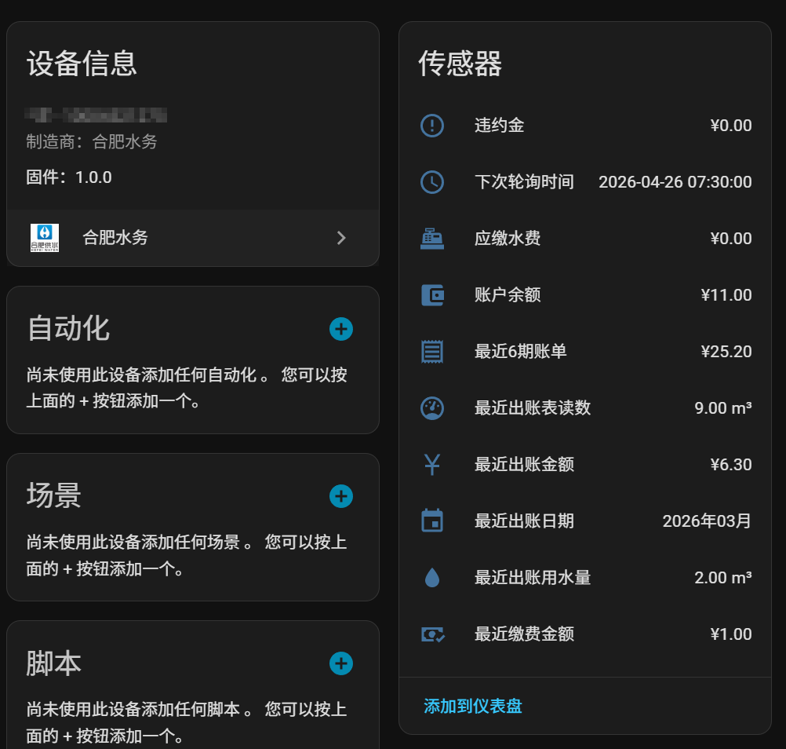
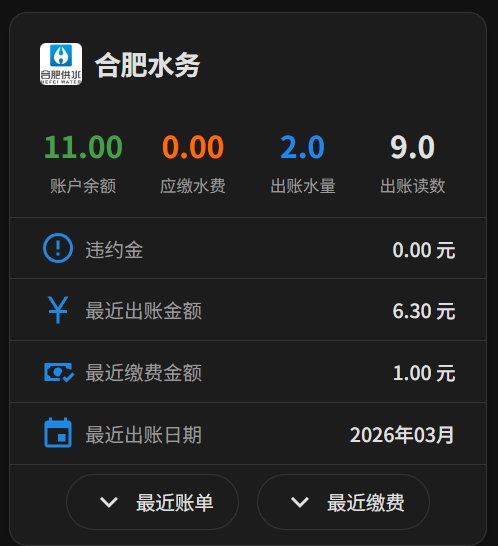
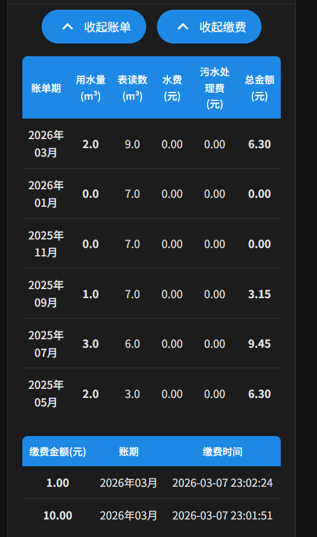

# 合肥水务 - Home Assistant 集成

通过微信小程序「合肥水务」的 API 获取水费账单和用水数据的 Home Assistant 自定义集成。

## 功能

- 📊 账户余额、应缴水费、违约金
- 💧 最近出账水量、表读数
- 📋 最近6期账单明细
- 💳 缴费记录
- 🎨 自定义 Lovelace 卡片

## 截图

### 集成展示

<div align="center">
  
  
</div>

### 卡片展示

<div align="center">
  
  
</div>

## 安装

### HACS 安装（推荐）

1. 在 HACS 中添加自定义仓库：`https://github.com/Cyborg2017/ha_hfwater`，类型选择 `Integration`
2. 在 HACS 中搜索「合肥水务」并安装
3. 重启 Home Assistant

### 手动安装

1. 下载本仓库
2. 将 `custom_components/hfwater` 目录复制到你的 HA 配置目录下的 `custom_components/hfwater`
3. 重启 Home Assistant

## 配置

1. 进入 **设置 → 设备与服务 → 添加集成**
2. 搜索「合肥水务」
3. 输入从微信小程序「合肥水务」抓包获取的 Token

### 获取 Token

1. 打开微信，搜索并进入「合肥水务」小程序
2. 使用抓包工具（如 Charles、Fiddler 等）捕获请求
3. 找到请求头中的 `token` 字段，复制其值

## Lovelace 卡片

集成安装后会自动注册自定义卡片 `hfwater-card`，在 Lovelace 中添加手动卡片：

```yaml
type: custom:hfwater-card
entity: sensor.hfwater_户号_account_balance
title: 合肥水务
```

## 传感器

| 传感器 | 说明 | 单位 |
|--------|------|------|
| `account_balance` | 账户余额 | CNY |
| `user_need_pay` | 应缴水费 | CNY |
| `user_late_fee` | 违约金 | CNY |
| `latest_bill_amount` | 最近出账金额 | CNY |
| `latest_bill_date` | 最近出账日期 | - |
| `latest_bill_water_usage` | 最近出账用水量 | m³ |
| `latest_bill_meter_reading` | 最近出账表读数 | m³ |
| `latest_pay_amount` | 最近缴费金额 | CNY |
| `recent_bills_total` | 最近6期账单总额 | CNY |
| `next_poll_time` | 下次轮询时间 | - |

## 注意事项

- Token 有效期有限，过期后需重新抓包获取
- 默认每24小时更新一次数据（每天早上7:30）
- 本项目仅供学习交流使用
